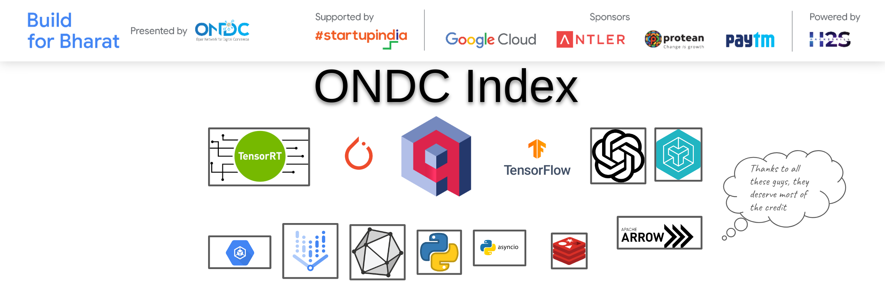

<!--  -->

#### THEME:
Retail Commerce

#### PERFORMANCE METRICS:

<table class="tg">
<thead>
  <tr>
    <th class="tg-s14z">Documents Indexed /min</th>
    <th class="tg-t1ql">23K</th>
  </tr>
</thead>
<tbody>
  <tr>
    <td class="tg-ycxo">Average Response Time</td>
    <td class="tg-t1ql">0.02ms-5ms</td>
  </tr>
</tbody>
</table>

#### PROBLEM NAME:
Catalog indexing engine

#### Highlights  :
Traditional **inverted indexes** are falling short. Their reliance on keywords alone hinders comprehension and adaptability. This innovative submission utilizes cutting-edge neural search paradigms to:

 - **Unlock Semantic Understanding**: Go beyond keywords to capture meaning, offering relevant and nuanced results.
 - **Embrace Dynamic Adaptations**: Learn from data, constantly improving relevance and tailoring results to user intent.
 - **Empower Customization**: Leverage flexible models like RAG and LLang Chain Agents, easily adapting to your specific needs.
  
#### Features:
- **Semantic Understanding**: Understands user intent and context, offering nuanced and relevant results.
- **Decentralized Indexing**: Master and Slave nodes for data distribution and parallel processing. Central node for query resolution and high speed 🚀 Slave nodes for data retrieval.
- **Customized Models**: Vector Search is 🚀, but Embedding is slow. Hence all models have been optimized from grond up using attention layer fusions and TensorRT backends.
- **Built for Scale**: Designed to handle very large-scale data and high query throughput.
- **Neural Sparse Engine**: Utilizes latest sparse neural search models and optimized for high speed and low latency.
- **TF Lite Tokenizer**: 10x faster than traditional tokenizers deployable on web and mobile platforms.
- **Native GPU Accelarated**: Utilizes native GPU accelerated server from NVIDIA open source.
- **Hybrid search**: Combines sparse and dense search for low latency and over 98% accuracy.

#### Modules
##### Embedding Engine

##### ETL Pipeline

##### Query Resolution

##### Generalized ER Diagram
